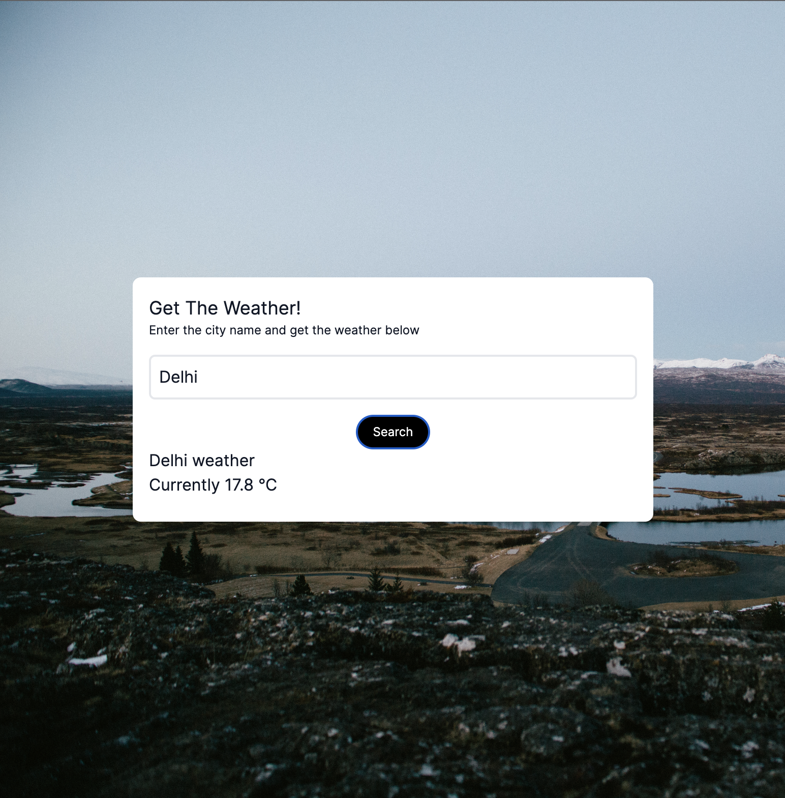

# Weather App

This is a weather app made using [Next.js](https://nextjs.org/) and
[WeatherAPI](https://www.weatherapi.com/)

## Preview



## Getting Started

First, run the development server:

```bash
npm run dev
# or
yarn dev
# or
pnpm dev
```

Open [http://localhost:3000](http://localhost:3000) with your browser to see the
result.
